**Final class diagram**

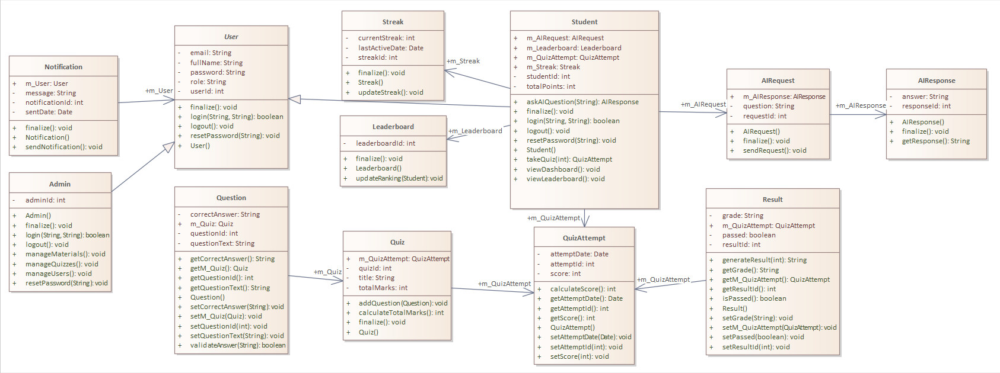

**A snippet of the auto-generated code**

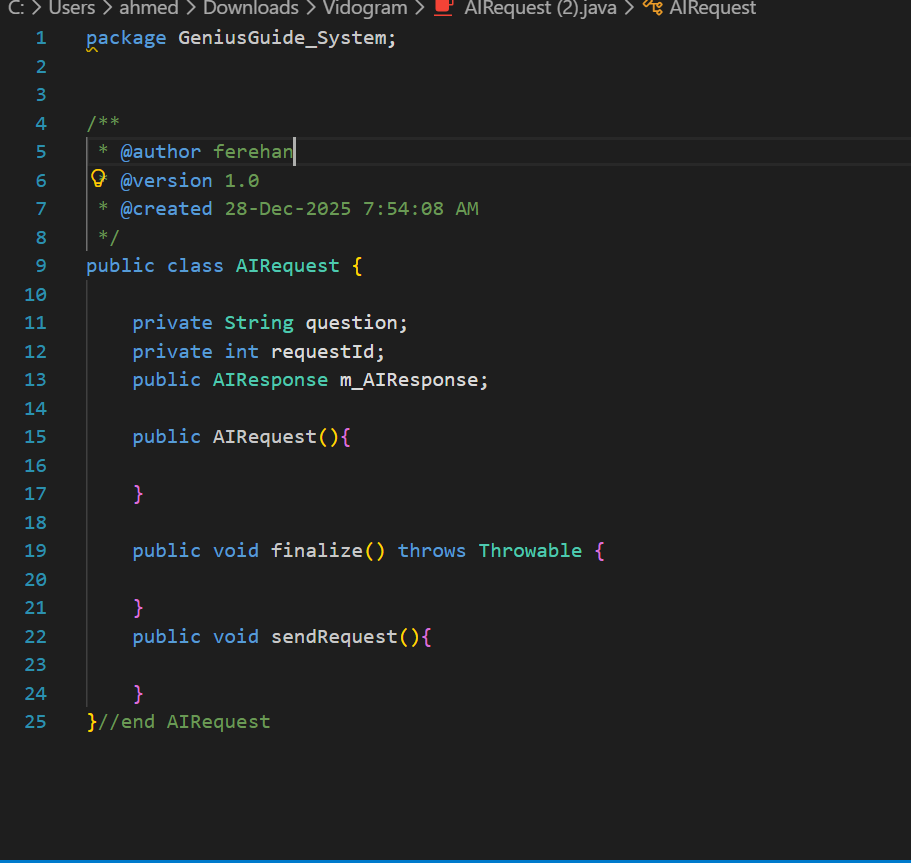

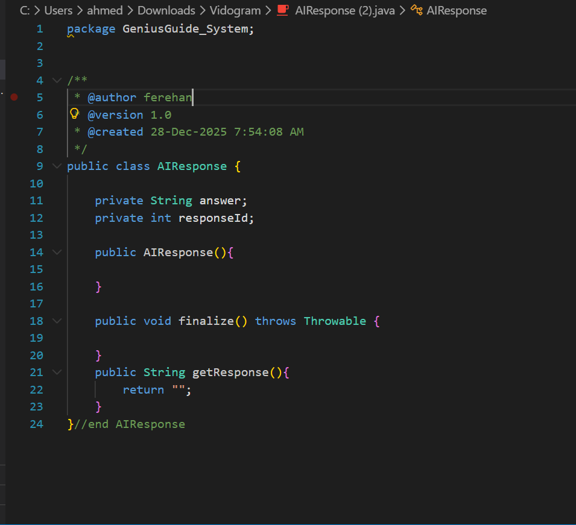

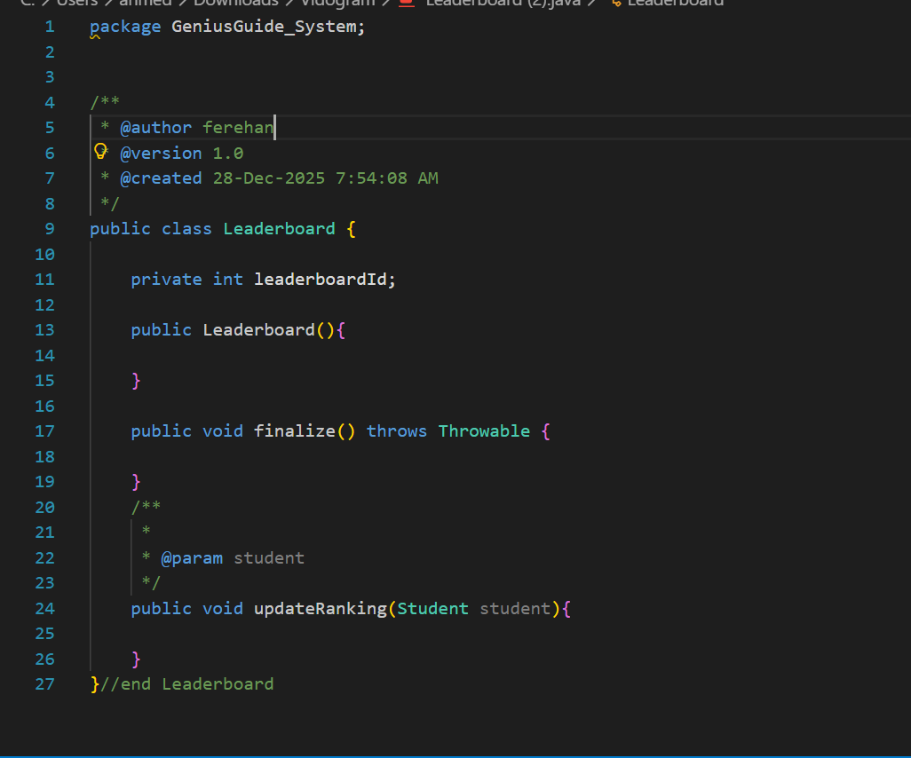

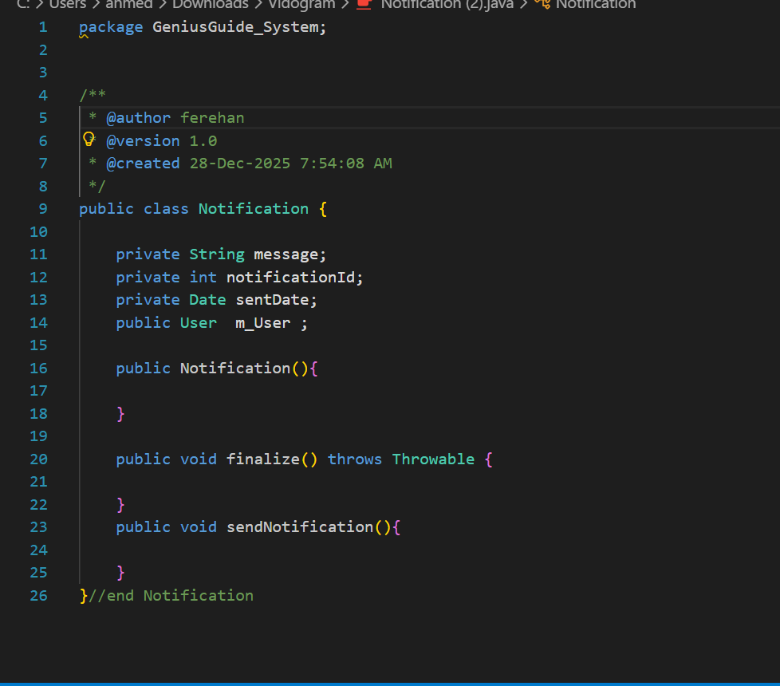

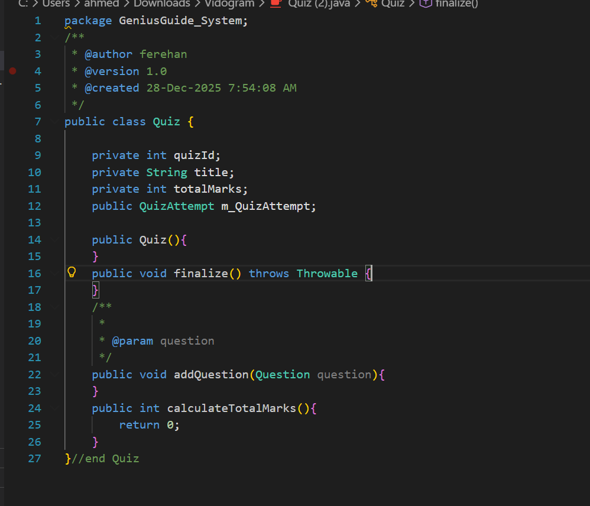

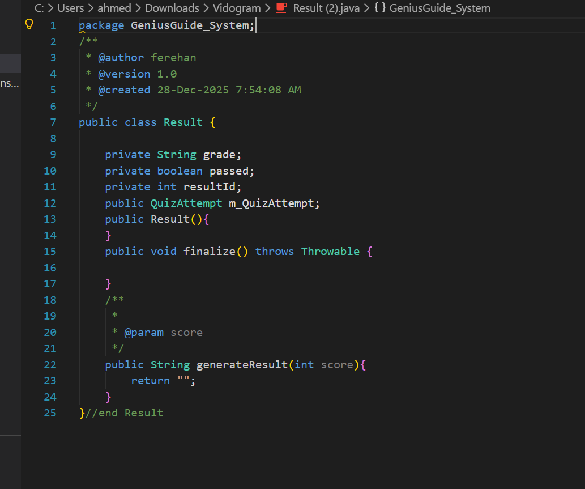

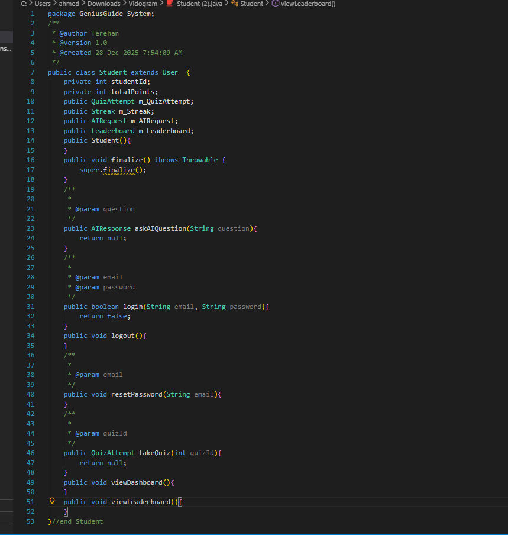

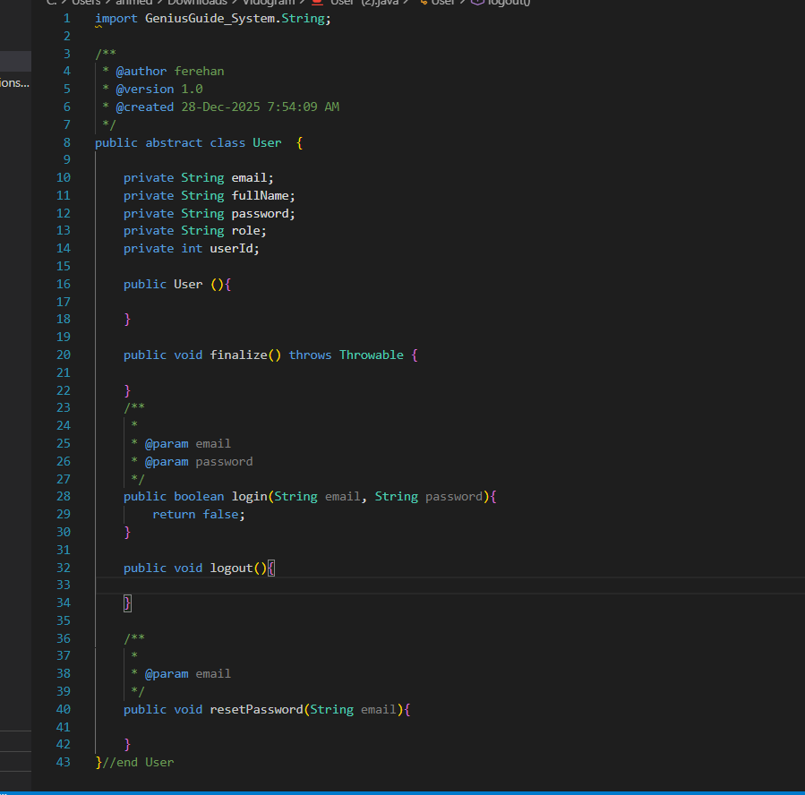

**A snippet of your manual code modifications**

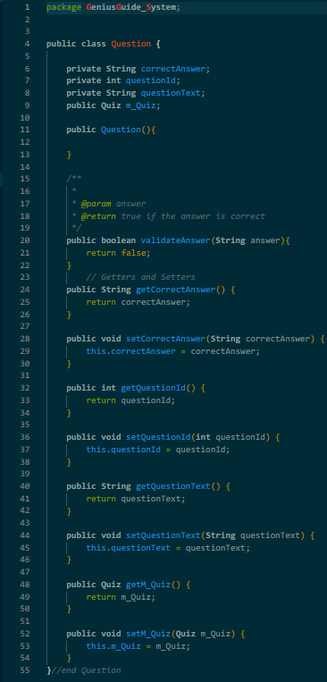

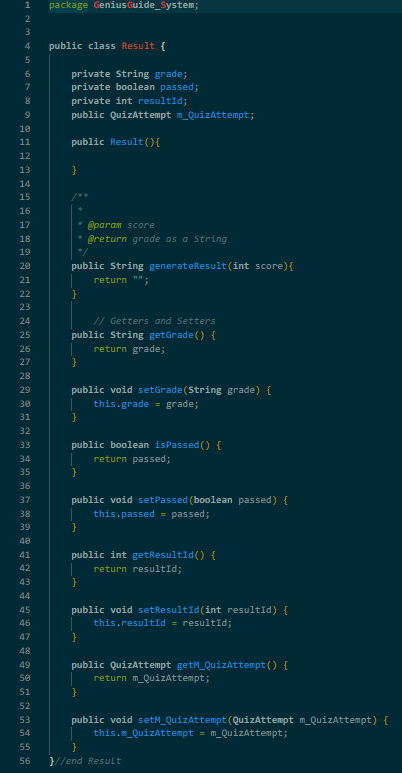

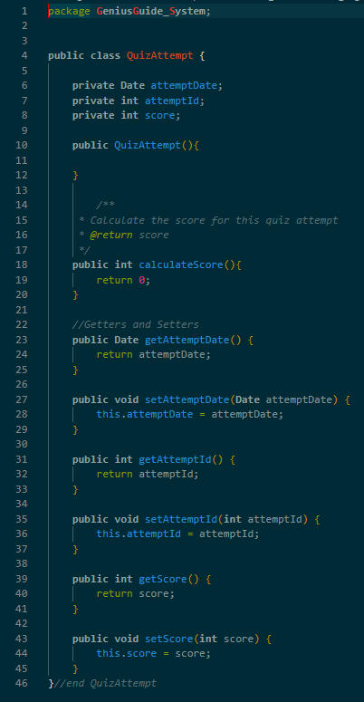

**The updated Class Diagram after reverse engineering the changes**

