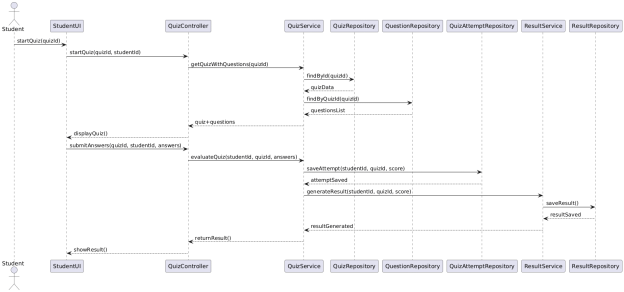
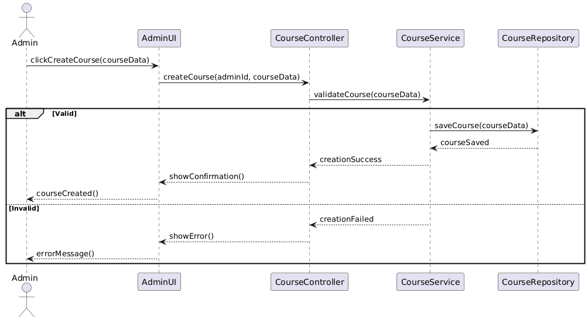
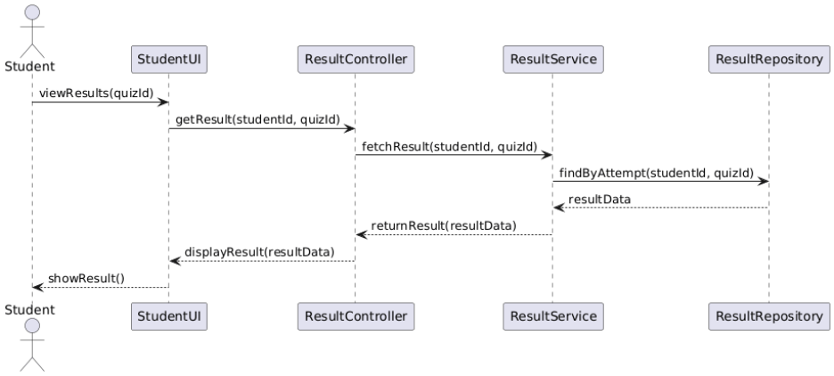
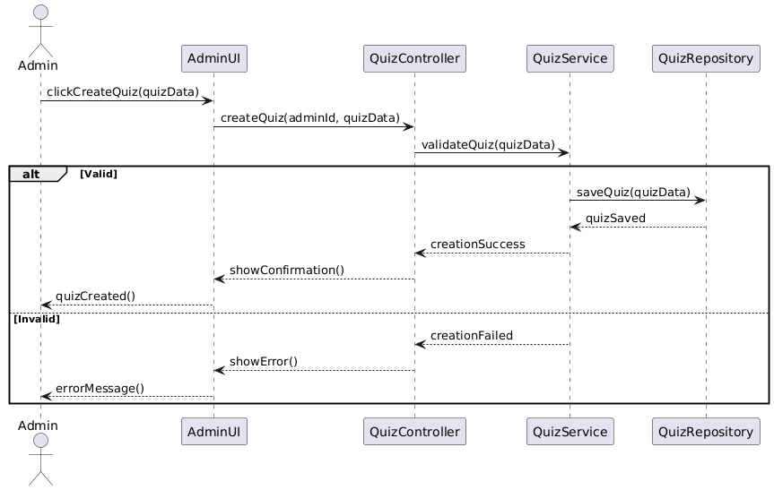
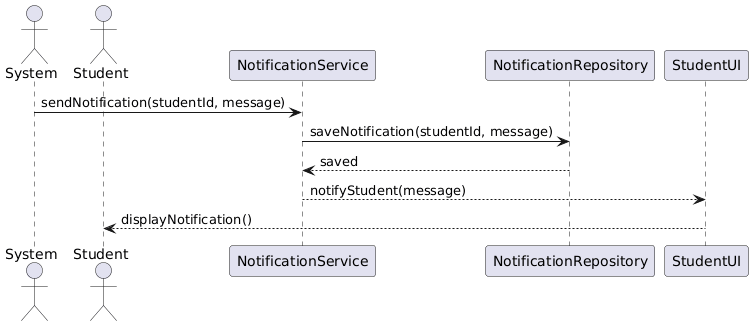

## system architecture diagrams

## Module Diagram

 (2).png>)

## Data flow Diagram

## High Level Database Schema

## Class diagram method definitions
## User (Abstract)
## ●login(email, password)
## ○Verifies user credentials from database
## ○Starts session if valid
## ●logout()
## ○Ends user session
## ●resetPassword(email)
## ○Sends password reset instruction

## Student
## ●viewDashboard()
## ○Displays quizzes, streak, leaderboard rank
## ●takeQuiz(quizId)
## ○Loads quiz
## ○Records answers
## ○Creates QuizAttempt
## ●askAIQuestion(question)
## ○Sends question to AI module
## ●viewLeaderboard()
## ○Retrieves ranking information

## Admin
## ●manageUsers()
## ○Add, update, delete users
## ●manageQuizzes()
## ○Create, update quizzes
## ●manageMaterials()
## ○Upload study resources

## Quiz
## ●addQuestion(question)
## ○Adds question to quiz
## ●calculateTotalMarks()
## ○Sums marks of all questions

## QuizAttempt
## ●calculateScore()
## ○Compares answers
## ○Computes total score

## Result
## ●generateResult(score)
## ○Determines grade and pass/fail

## Streak

## ● updateStreak()

## ○ Increments streak if active daily

## Question

## ● getQuestionText()

## ○ Returns the text of the question

## ● getCorrectAnswer()

## ○ Returns the correct answer

## ● validateAnswer(answer)

## ○ Checks if the answer is correct

## ● getOptions()

## ○ Returns all answer options

## Leaderboard

## ● updateRanking(student)

## ○ Updates student rank

## Notification

## ● sendNotification()

## ○ Sends message to user

## AIRequest

## ● sendRequest()

## ○ Sends prompt to AI service

## AIResponse

## ● getResponse()

## ○ Returns AI explanation

## Pseudocode or algorithms

## 1. User (Abstract Class)

## login(email, password)
## INPUT email, password
## FETCH user record from User DB using email
##  
## IF user exists AND storedPassword == password THEN
##     START user session
##     RETURN true
## ELSE
##     RETURN false
## END IF
##  
## logout()
## END current user session
## CLEAR session data
##  
## resetPassword(email)
## INPUT email
## CHECK if email exists in User DB
##  
## IF email exists THEN
##     GENERATE reset token
##     SEND reset instructions to user email
## ELSE
##     DISPLAY "Email not found"
## END IF
##  
## 2. Student (inherits User)

## viewDashboard()
## FETCH student quizzes
## FETCH streak information
## FETCH leaderboard rank
## DISPLAY dashboard data
##  
## takeQuiz(quizId)
## INPUT quizId
## FETCH quiz details using quizId
## DISPLAY questions to student
##  
## RECORD student answers
## CREATE new QuizAttempt
## CALL calculateScore()
## STORE attempt result
## RETURN QuizAttempt
##  
## askAIQuestion(question)
## INPUT question
## CREATE AIRequest object
## SEND request to AI Service
## RECEIVE AIResponse
## RETURN AIResponse
##  
## viewLeaderboard()
## FETCH leaderboard data
## DISPLAY student rankings
##  
## 3. Admin (inherits User)

## manageUsers()
## DISPLAY list of users
## ALLOW add, update, or delete user
## SAVE changes to User DB
##  
## manageQuizzes()
## DISPLAY quizzes
## ALLOW create, update, delete quiz
## SAVE changes to Quiz DB
##  
## manageMaterials()
## UPLOAD or update study materials
## SAVE materials in system
##  
## 4. Quiz

## addQuestion(question)
## INPUT question
## ADD question to quiz question list
## UPDATE quiz data
##  
## calculateTotalMarks()
## totalMarks = 0
## FOR each question in quiz
##     totalMarks = totalMarks + question.marks
## END FOR
## RETURN totalMarks
##  
## 5. Question

## validateAnswer(answer)
## INPUT answer
## IF answer == correctAnswer THEN
##     RETURN true
## ELSE
##     RETURN false
## END IF
##  
## 6. QuizAttempt

## calculateScore()
## score = 0
## FOR each question in quiz
##     IF validateAnswer(studentAnswer) == true THEN
##         score = score + question.marks
##     END IF
## END FOR
## RETURN score

7. Result
   generateResult(score)
   INPUT score
   IF score >= passMark THEN
   grade = "Pass"
   passed = true
   ELSE
   grade = "Fail"
   passed = false
   END IF
   STORE result
   RETURN grade

8. Streak
   updateStreak()
   IF lastActiveDate == yesterday THEN
   currentStreak = currentStreak + 1
   ELSE
   currentStreak = 1
   END IF

UPDATE lastActiveDate
SAVE streak data

9. Leaderboard
   updateRanking(student)
   FETCH all students and scores
   SORT students by totalPoints descending
   UPDATE ranking positions
   SAVE leaderboard data

10. Notification
    sendNotification()
    INPUT message, userId
    CHECK if user exists
    SEND notification to user
    STORE notification record

11. AIRequest
    sendRequest()
    SEND question to AI Service
    WAIT for response
    FORWARD response to AIResponse

12. AIResponse
    getResponse()
    RECEIVE response from AI Service
    RETURN AI-generated answer

## Detailed Database Tables

## 1.User Table (Abstract → User, Parent of Student & Admin)

## CREATE TABLE users (

## user_id INT AUTO_INCREMENT PRIMARY KEY,

## name VARCHAR(100) NOT NULL,

## email VARCHAR(150) NOT NULL UNIQUE,

## password_hash VARCHAR(255) NOT NULL,

## role ENUM('STUDENT', 'ADMIN') NOT NULL,

## created_at TIMESTAMP DEFAULT CURRENT_TIMESTAMP

## );

##

## 2. Students Table (inherits User)

## CREATE TABLE students (

## student_id INT PRIMARY KEY,

## FOREIGN KEY (student_id) REFERENCES users(user_id)

## ON DELETE CASCADE

## );

##

## 3. Admins Table (inherits User)

## CREATE TABLE admins (

## admin_id INT PRIMARY KEY,

## FOREIGN KEY (admin_id) REFERENCES users(user_id)

## ON DELETE CASCADE

## );

##

## 4. Quiz Table

## CREATE TABLE quizzes (

## quiz_id INT AUTO_INCREMENT PRIMARY KEY,

## title VARCHAR(150) NOT NULL,

## total_marks INT DEFAULT 0,

## created_by INT,

## created_at TIMESTAMP DEFAULT CURRENT_TIMESTAMP,

## FOREIGN KEY (created_by) REFERENCES admins(admin_id)

## );

##

## 5. Question Table (Composition with Quiz)

## CREATE TABLE questions (

## question_id INT AUTO_INCREMENT PRIMARY KEY,

## quiz_id INT NOT NULL,

## question_text TEXT NOT NULL,

## correct_answer VARCHAR(255) NOT NULL,

## marks INT NOT NULL,

## FOREIGN KEY (quiz_id) REFERENCES quizzes(quiz_id)

## ON DELETE CASCADE

## );

##

## 6. QuizAttempt Table

## CREATE TABLE quiz_attempts (

## attempt_id INT AUTO_INCREMENT PRIMARY KEY,

## student_id INT NOT NULL,

## quiz_id INT NOT NULL,

## score INT DEFAULT 0,

## attempted_at TIMESTAMP DEFAULT CURRENT_TIMESTAMP,

## FOREIGN KEY (student_id) REFERENCES students(student_id),

## FOREIGN KEY (quiz_id) REFERENCES quizzes(quiz_id)

## );

## 7.  Result Table (1-to-1 with QuizAttempt)

## CREATE TABLE results (

## result_id INT AUTO_INCREMENT PRIMARY KEY,

## attempt_id INT UNIQUE NOT NULL,

## grade VARCHAR(20),

## generated_at TIMESTAMP DEFAULT CURRENT_TIMESTAMP,

## FOREIGN KEY (attempt_id) REFERENCES quiz_attempts(attempt_id)

## 	ON DELETE CASCADE

## );

##

## 8.  Streak Table (1-to-1 with Student)

## CREATE TABLE streaks (

## streak_id INT AUTO_INCREMENT PRIMARY KEY,

## student_id INT UNIQUE NOT NULL,

## current_streak INT DEFAULT 0,

## last_activity DATE,

## FOREIGN KEY (student_id) REFERENCES students(student_id)

## 	ON DELETE CASCADE

## );

##

## 9.  Leaderboard Table (Aggregation of Students)

## CREATE TABLE leaderboard (

## leaderboard_id INT AUTO_INCREMENT PRIMARY KEY,

## student_id INT NOT NULL,

## total_score INT DEFAULT 0,

## rank_position INT,

## FOREIGN KEY (student_id) REFERENCES students(student_id)

## );

##

## 10. Notifications Table

## CREATE TABLE notifications (

## notification_id INT AUTO_INCREMENT PRIMARY KEY,

## user_id INT NOT NULL,

## message TEXT NOT NULL,

## is_read BOOLEAN DEFAULT FALSE,

## sent_at TIMESTAMP DEFAULT CURRENT_TIMESTAMP,

## FOREIGN KEY (user_id) REFERENCES users(user_id)

## 	ON DELETE CASCADE

## );

##

## 11. AI Requests Table

## CREATE TABLE ai_requests (

## request_id INT AUTO_INCREMENT PRIMARY KEY,

## student_id INT NOT NULL,

## question TEXT NOT NULL,

## requested_at TIMESTAMP DEFAULT CURRENT_TIMESTAMP,

## FOREIGN KEY (student_id) REFERENCES students(student_id)

## 	ON DELETE CASCADE

## );

##

## 12. AI Responses Table (1-to-1)

## CREATE TABLE ai_responses (

## response_id INT AUTO_INCREMENT PRIMARY KEY,

## request_id INT UNIQUE NOT NULL,

## response TEXT NOT NULL,

## responded_at TIMESTAMP DEFAULT CURRENT_TIMESTAMP,

## FOREIGN KEY (request_id) REFERENCES ai_requests(request_id)

## 	ON DELETE CASCADE

## );

## Sequence diagrams
2. student takes quize 

3. student ask AI Assistant
   
4. Admin Creates a Course

5. Student Views Results

6. Admin Creates Quiz

7. Notification Sent to Student

## Error handling and validations

