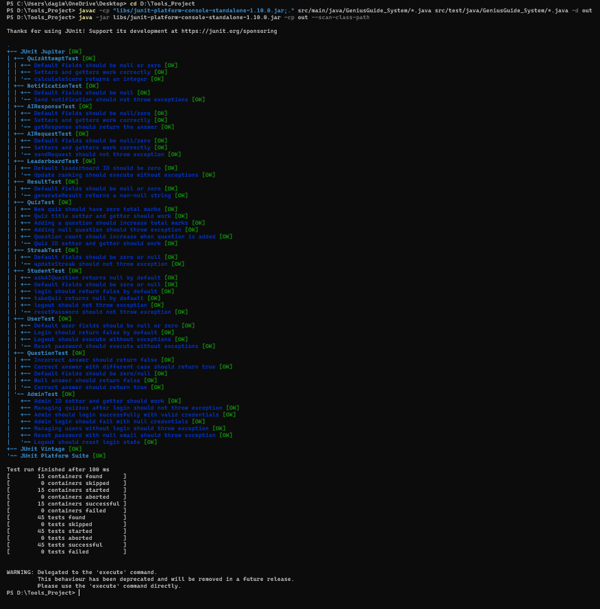

**after testing using junit the result we get is as follows**

**Test run finished after 92 ms**
**[ 15 containers found ]**
**[ 0 containers skipped ]**
**[ 15 containers started ]**
**[ 0 containers aborted ]**
**[ 15 containers successful ]**
**[ 0 containers failed ]**
**[ 45 tests found ]**
**[ 0 tests skipped ]**
**[ 45 tests started ]**
**[ 0 tests aborted ]**
**[ 45 tests successful ]**
**[ 0 tests failed ]**

**Snippet of the result**

